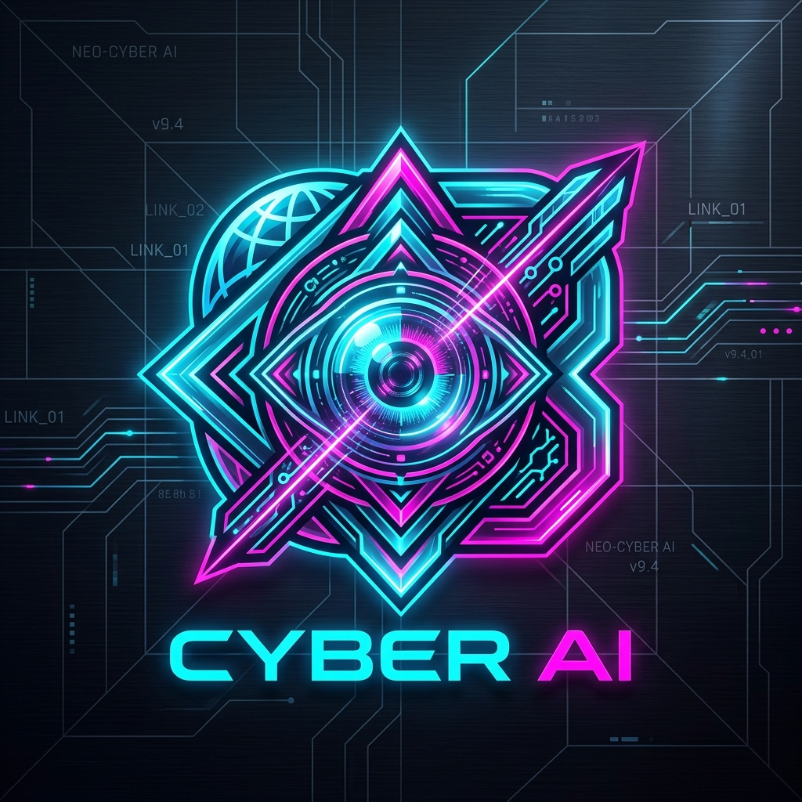

# ⚡ NEXUS // Cyberpunk AI Tools Browser & Tactical Intelligence

A futuristic, high-performance cyberpunk-themed browser and tactical directory for navigating, exploring, and understanding modern AI tools and ecosystems.



## 🚀 Features

- **🔍 Neural Tool Matrix**: Search and filter across 30+ categorized premier AI tools (LLMs, code generation, creative imagery, audio synthesis, agent frameworks, and research).
- **🎛️ Dynamic Matrix Filtering**: Filter by category, pricing tiers, capabilities, and real-time tags.
- **🤖 Tactical AI Intelligence Deck**: Non-intrusive HUD drawer with AI tactical dossiers and tool explanations.
- **🔊 Cyber Audio Synthesizer**: Pure Web Audio API synthetic telemetry and UI sound effects with zero external audio assets.
- **💎 Cyberpunk Neon HUD Design**: Glowing neon cyan, hot magenta, dark glassmorphism, responsive tactile card components with rounded corners and touch gesture support.
- **⚡ Express / Node.js Backend**: Built-in HTTP server with health-check telemetry API endpoint.

---

## 🛠️ Tech Stack

- **Frontend**: HTML5, Vanilla JavaScript (ES6+), Vanilla CSS (Cyberpunk HUD Design System)
- **Audio Engine**: Web Audio API Synthetic Generator
- **Backend Server**: Node.js & Express 5
- **UI Components**: Interactive Tactile Cards with Touch Gesture support

---

## 🏁 Quick Start

### Prerequisites
- [Node.js](https://nodejs.org/) (v18+ recommended)

### 1. Clone the repository
```bash
git clone https://github.com/<YOUR_USERNAME>/<YOUR_REPO_NAME>.git
cd nexus-ai-browser
```

### 2. Install dependencies
```bash
npm install
```

### 3. Launch the server
```bash
node server.js
```

### 4. Access the application
Open your browser and navigate to:
```
http://localhost:3000
```

---

## 📡 API Endpoints

| Method | Route | Description |
|---|---|---|
| `GET` | `/` | Main Cyberpunk Browser UI |
| `GET` | `/api/health` | System status & uptime telemetry (JSON) |

---

## 📄 License
MIT License.
